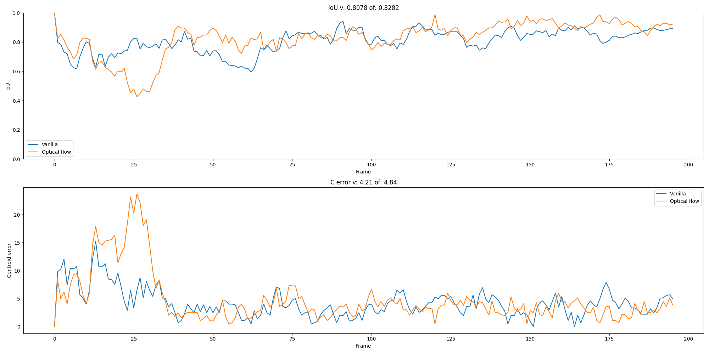
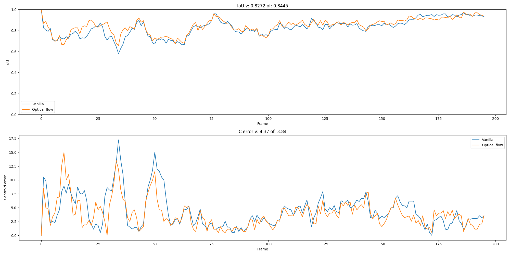

# GoTurnAgain

Reimplementation of the GoTurn model from the paper "Learning to Track at 100 FPS with Deep Regression Networks" by David Held, Sebastian Thrun, Silvio Savarese

We changed the pretrained network and integrated optical flow to improve the tracking performance.

Here is the original paper: https://arxiv.org/abs/1604.01802

# Usage

## Training
Run the `train.py` script to train the model.

## Eval 
Run the `eval.py` script to evaluate the model.

For a pretrained checkpont of the original model, download the weights from the PyGOTURN repository.

# Results

We measured the IoU and the centroid error for the original model and our model.

--- 

